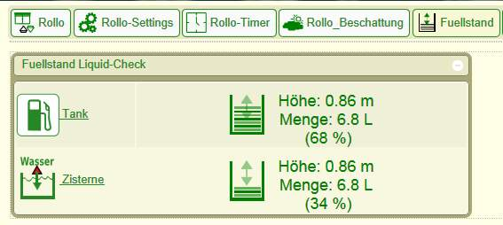

# FHEM Module Liquid-Check 
**Fhem Modul and Documentation for the "Liquid-Check" Levelsensor.**

- liquid_check_doku.pdf
  - [Dokumentation de](doc/liquid_check_dokuA5_160.pdf) of the "Liquid-Check" Levelsensor device
  - [Manual en](doc/liquid_check_dokuA5en.pdf) of the "Liquid-Check" Levelsensor device
  
- src/FHEM/24_SI_Liquid_Check.pm
  - Fhem Modul for easy integration of the Liquid-Check Levelsensor, is copied by the install routine to ./FHEM/\*.\* 
  
- src/www/images/default/sidev/fuellstand/\*.\*
  - this icons are the default icons for the fhem-modul "24_SI_Liquid_Check.pm", this immages will be also
    copied with the install routine.     

  
*For easy download use FHEM-Update feature /see "Install"*  


## Übersicht Geräte

### Liquid-Check Aufbau


## Übersicht Fhem
*Eine Besonderheit ist, dass StateIcon und Werte angezeigt werden.
Des Weitern können beliebige Icons als StateIcon verwendet werde dessen Dateiname mit 10, 20 .... 100 endet.*



### Liquid-Check SM1 (Mit Schaltmodul und 4 Eingänge für 1-Wire Temp.-Sensoren)


## Install
**Adds an additional repository for simplified use of "Update" via the standard calls.**
*Run the following commands in FHEM command-line to add this repository to your FHEM setup:*
```
update add https://raw.githubusercontent.com/SI-ElektronikGmbH/Liquid-Check/master/src/controls_liquid_check.txt
update all liquid_check
shutdown restart
```

**One time update**
```
update check https://raw.githubusercontent.com/SI-ElektronikGmbH/Liquid-Check/master/src/controls_liquid_checktxt
update all https://raw.githubusercontent.com/SI-ElektronikGmbH/Liquid-Check/master/src/controls_liquid_check.txt

```

